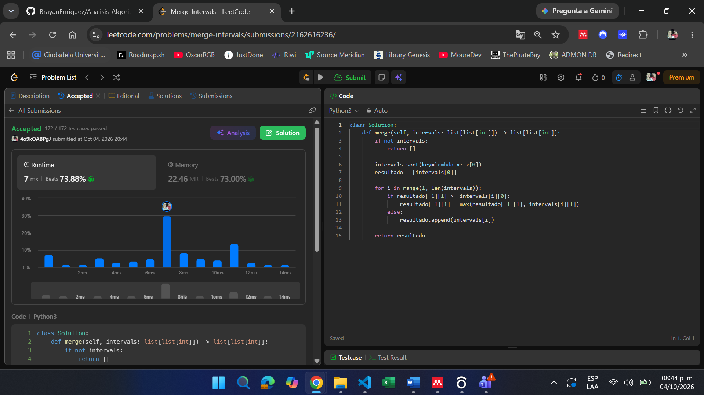
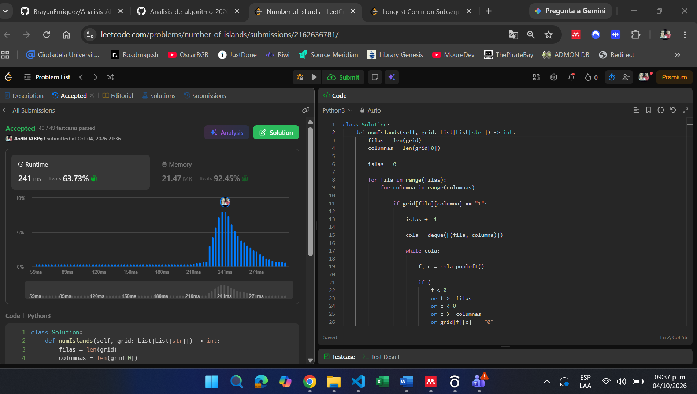
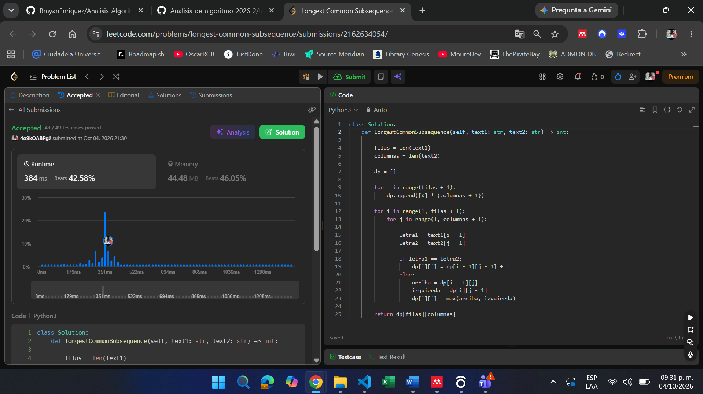
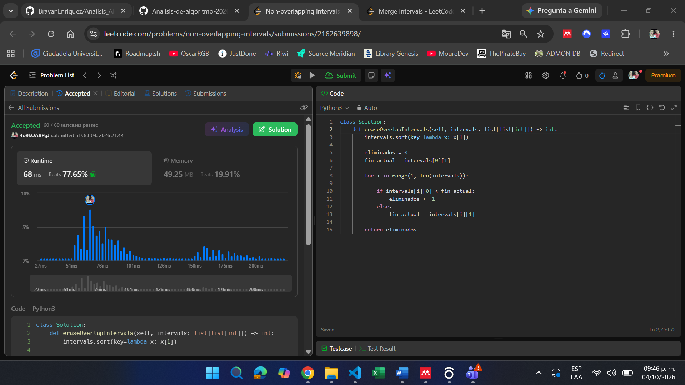
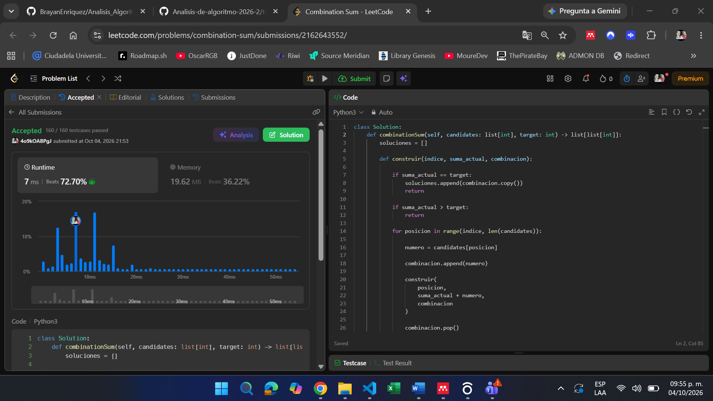

## 56. Merge Intervals
Problema: https://leetcode.com/problems/merge-intervals/

Familia: Ordenamiento
Idea: Se ordenan los intervalos según su valor inicial. Luego se recorren en orden y se fusionan aquellos que se superponen, manteniendo siempre el último intervalo construido.

Complejidad:
- Tiempo: O(n log n), donde n es la cantidad de intervalos.
- Espacio: O(n).

---

## 200. Number of Islands

Problema: https://leetcode.com/problems/number-of-islands/

Familia: Grafos 

Idea: La matriz se interpreta como un grafo donde cada celda de tierra representa un nodo. Cuando se encuentra una tierra no visitada, se realiza un recorrido DFS para visitar toda la isla y contarla una sola vez.

Complejidad:
- Tiempo: O(m · n), donde m es el número de filas y n el número de columnas.
- Espacio: O(m · n).

---

## 1143. Longest Common Subsequence

Problema: https://leetcode.com/problems/longest-common-subsequence/

Familia: Programación Dinámica

Idea: Se construye una tabla DP donde cada posición almacena la longitud de la subsecuencia común más larga para un prefijo de cada cadena. Si los caracteres coinciden se toma la diagonal más uno; en caso contrario se toma el máximo entre arriba e izquierda.

Complejidad:
- Tiempo: O(m · n), donde m y n son las longitudes de las cadenas.
- Espacio: O(m · n).

---

## 435. Non-overlapping Intervals

Problema: https://leetcode.com/problems/non-overlapping-intervals/

Familia: Greedy

Idea: Se ordenan los intervalos por su punto final. En cada paso se conserva el intervalo que termina primero porque deja más espacio disponible para los siguientes. Los intervalos que generan solapamiento se cuentan como eliminados.

Complejidad:
- Tiempo: O(n log n), donde n es la cantidad de intervalos.
- Espacio: O(1).

---

## 39. Combination Sum

Problema: https://leetcode.com/problems/combination-sum/

Familia: Backtracking

Idea: Se construyen combinaciones de manera recursiva. En cada paso se elige un candidato, se explora la solución parcial y posteriormente se deshace la elección mediante backtracking para probar nuevas alternativas.

Complejidad:
- Tiempo: Exponencial en función del objetivo y de la cantidad de candidatos.
- Espacio: O(T), donde T es la profundidad máxima de la recursión.

